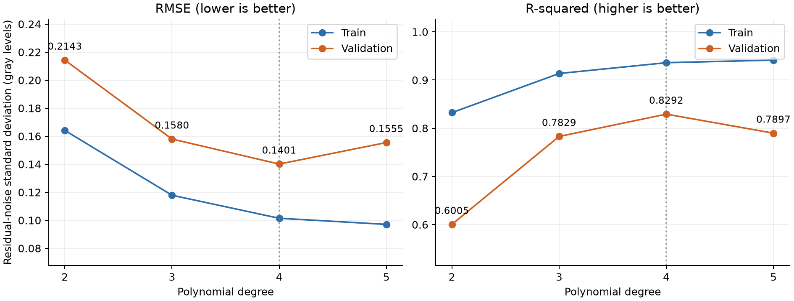
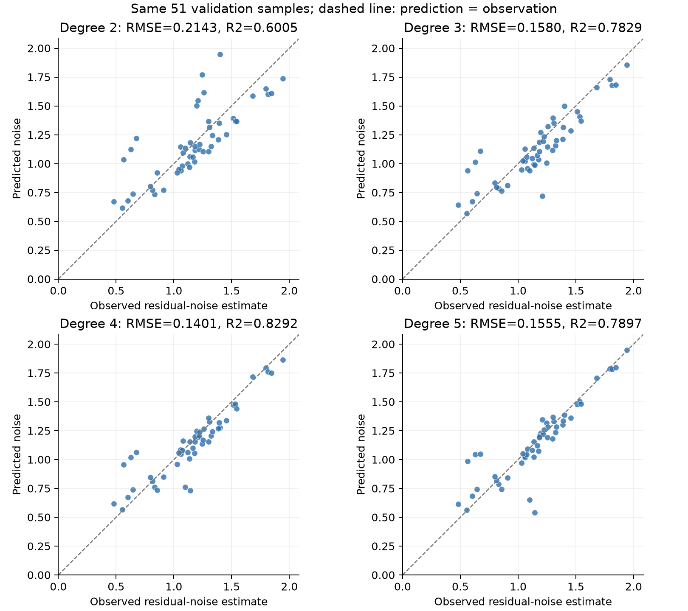
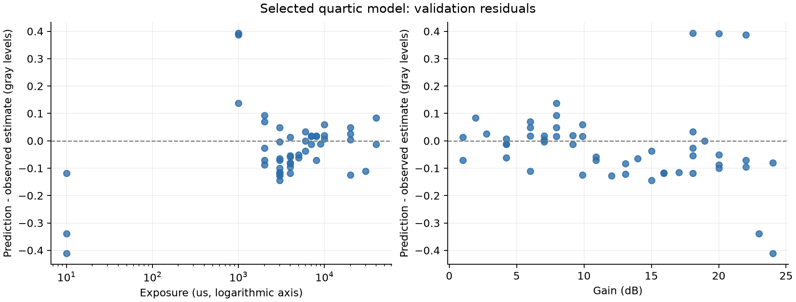

## 阶数比较与模型选择

### 比较方法

四个模型均使用同一批 254 条通过筛选的数据，随机种子固定为 42。
训练集为 203 条，验证集为 51 条；程序逐文件核对四个模型的划分完全一致。
所有模型采用普通最小二乘法，标准化只使用训练集。模型阶数改变时，没有重新抽取验证样本。
预测目标均为白墙 ROI 高斯平滑残差的标准差；两个自变量均为实际曝光时间和实际增益。

本次选择以验证集 RMSE 为主要指标，同时检查 MAE、最大绝对误差和参数数量。
在同一验证集上，MSE、RMSE 与 $R^2$ 都基于同一个误差平方和，因此其排序一致，不能当作三项独立证据。

### 各模型结果

| 阶数 | 参数数 | 训练 RMSE | 训练 $R^2$ | 验证 MAE | 验证 RMSE | 验证 $R^2$ | 验证最大绝对误差 |
| --- | ---: | ---: | ---: | ---: | ---: | ---: | ---: |
| 2 次 | 6 | 0.1641 | 0.8323 | 0.1624 | 0.2143 | 0.6005 | 0.5461 |
| 3 次 | 10 | 0.1179 | 0.9135 | 0.1179 | 0.1580 | 0.7829 | 0.4895 |
| **4 次（最终选择）** | 15 | 0.1014 | 0.9359 | 0.0937 | 0.1401 | 0.8292 | 0.4106 |
| 5 次 | 21 | 0.0971 | 0.9414 | 0.0901 | 0.1555 | 0.7897 | 0.6004 |

图 1：训练 RMSE 随阶数增加而下降；验证指标用于判断增加复杂度是否改善当前未参与拟合样本的预测。

### 为什么选择四次

- 相比2次，四次验证 RMSE 从 0.2143 降至 0.1401，下降 34.62%。这说明在本次划分中，增加到四次能够描述更多曝光与增益的非线性关系。
- 相比3次，四次验证 RMSE 从 0.1580 降至 0.1401，下降 11.30%。这说明在本次划分中，增加到四次能够描述更多曝光与增益的非线性关系。
- 从四次到五次，参数由 15 个增加到 21 个，训练 RMSE 从 0.1014 降至 0.0971，但验证 RMSE 升至 0.1555（增加 10.96%）。更好的训练拟合没有转化为更好的验证 RMSE，表现出过拟合迹象。
- 五次并非所有指标都更差：验证 MAE 为 0.0901，略低于四次的 0.0937；但最大绝对误差从 0.4106 增加到 0.6004。这说明五次减小了平均绝对误差，却加重了部分较大误差，平方误差指标对此更敏感。

**在本次考察的二至五次模型、当前数据和固定验证划分下，四次的验证 RMSE 最低（0.1401），验证 $R^2$ 最高（0.8292），且比五次少 6 个参数，因此选用四次。**

### 预测与观测值的比较

图 2：横轴为单图残差法得到的噪声估计值，纵轴为模型预测值；四幅子图使用相同坐标范围。点越接近虚线 $y=x$，预测越准确。这里的观测值是噪声代理量，不是独立标定的传感器真实噪声。

### 四次模型的误差分析

图 3：残差定义为“预测值减观测值”。正值表示高估，负值表示低估；曝光轴使用对数尺度以展示不同数量级。

四次模型验证残差的平均值为 -0.0200 灰度级，范围为 [-0.4106, 0.3933]。以下列出绝对误差最大的 5 个验证样本，便于回看原图：

| 图片 | 曝光（μs） | 增益（dB） | 观测噪声 | 预测噪声 | 残差 |
| --- | ---: | ---: | ---: | ---: | ---: |
| `e10g24.bmp` | 10 | 24.0143 | 1.1419 | 0.7312 | -0.4106 |
| `e1000g18.bmp` | 1000 | 18.0618 | 0.5643 | 0.9576 | +0.3933 |
| `e1000g20.bmp` | 1000 | 20.0000 | 0.6281 | 1.0194 | +0.3913 |
| `e1000g22.bmp` | 1000 | 22.0246 | 0.6742 | 1.0607 | +0.3865 |
| `e10g23.bmp` | 10 | 22.9998 | 1.0995 | 0.7602 | -0.3393 |

为定位误差来源，另按曝光是否超过 1000 μs 对验证样本作事后分组。这个分组只用于诊断，没有重新筛选样本或修改拟合结果。

| 验证样本分组 | 数量 | RMSE | 平均残差 |
| --- | ---: | ---: | ---: |
| 曝光 ≤ 1000 μs | 7 | 0.3324 | +0.0629 |
| 曝光 > 1000 μs | 44 | 0.0719 | -0.0332 |

短曝光组占验证样本的 13.73%，却贡献了 77.26% 的验证误差平方和。结合上面的最大误差样本与残差图，可以定位四次模型仍需改进的参数区域；因此较高的总体 $R^2$ 并不表示所有曝光/增益组合都拟合良好。

误差可能同时来自多项式近似不足、单图残差估计中残留的墙面纹理、空间相关性及相机图像处理。当前结果不能单独判定各因素的贡献，也不能用低残差证明物理噪声测量准确。

### 结论的适用范围

- “四次最好”仅指当前比较的模型在本次验证划分上的 RMSE 最低，不是对所有模型或新场景的普遍证明。
- 验证集已用于选择阶数，不能再称为未使用过的独立测试集。若要检验选择的稳定性，可进一步使用交叉验证或新的独立数据。
- 过曝、截黑等样本已根据预先的图像质量规则排除；结论不能外推到全部 696 组条件。
- 当前噪声指标是白墙 ROI 的高频残差标准差，不是时间噪声，模型也不是传感器物理参数标定。

### 可复现结果

- [完整指标表](../model_comparison/metrics.csv)
- [二次模型报告](../regression/report.md)
- [三次模型报告](../regression_cubic/report.md)
- [四次模型报告](../regression_quartic/report.md)
- [五次模型报告](../regression_quintic/report.md)

复现命令：`python compare_noise_models.py`。PNG 用于报告预览，同名 SVG 可用于清晰排版。
本节代码、图表和分析文字在 OpenAI Codex 协助下生成；全部数值由本地实验数据计算。
